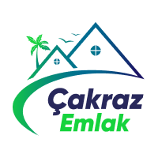

<p align="center">
  <a href="https://cakraz-emlak.vercel.app">
    
  </a>
</p>
<h1 align="center">
  Çakraz Emlak
</h1>

Real estate website wtih Gatsby & Strapi.

## 🚀 Setup CMS

1.  **Clone Strapi CMS**

    Clone [cakraz-emlak-cms](https://github.com/oktay/cakraz-emlak-cms) for backend and content managment. **Follow instructions in the [`cakraz-emlak-cms/README.md`](https://github.com/oktay/cakraz-emlak-cms/README.md) file.**

    ```shell
    # clone repo
    git clone https://github.com/oktay/cakraz-emlak-cms
    cd cakraz-emlak-cms
    yarn install
    ```

3.  **Start Strapi Server**

    ```shell
    yarn develop
    ```

    Your backend/cms is now running at `http://localhost:1337`!
    
    *Note: If your first time, you need create admin user, create **at least one content for each content type** and activate **`find`**, **`findone`** permissions for content types **otherwise you cant run gatsby server.***

## 🌟 Run Frontend

When Strapi part is done and running, you can start develop frontend part.

1.  **Clone Frontend**

    ```shell
    git clone https://github.com/oktay/cakraz-emlak
    cd cakraz-emlak
    yarn install
    ```
    
2. **Run server**

   ```shell
   yarn develop
   ```
    
    Your site is now running at `http://localhost:8000!`

    *Note: You'll also see a second link: `http://localhost:8000/___graphql`. This is a tool you can use to experiment with querying your data. Learn more about using this tool     in the Gatsby tutorial.*
